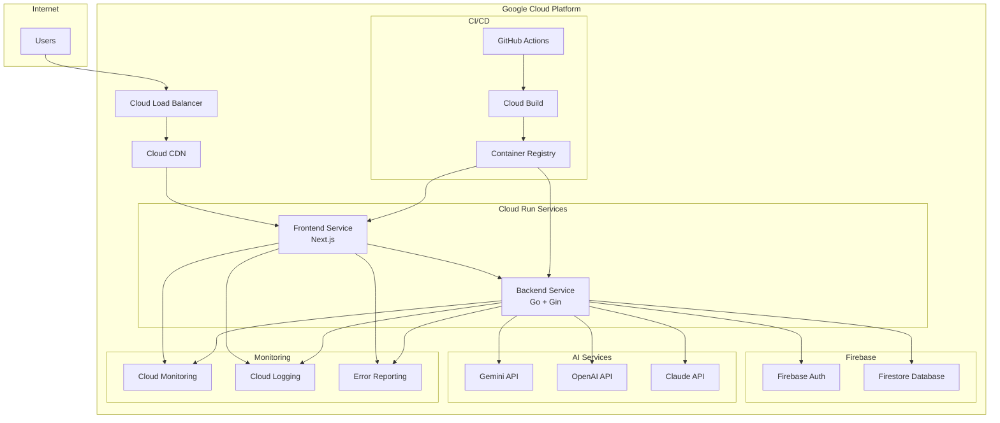

# デプロイメントガイド

## 概要

サドンデス勝ち上がり式クイズアプリケーションのGoogle Cloud Platform (GCP) へのデプロイメント手順書。フロントエンド（Next.js）とバックエンド（Go + Gin）をCloud Runにデプロイし、Firebase、CI/CDパイプラインを含む完全な本番環境構築を行う。

## アーキテクチャ概要



## 前提条件

### 必要なアカウント・サービス
- Google Cloud Platform アカウント
- Firebase プロジェクト
- GitHub アカウント
- Gemini API キー
- OpenAI API キー（オプション）
- Claude API キー（オプション）

### 必要なツール
```bash
# Google Cloud CLI
curl https://sdk.cloud.google.com | bash
exec -l $SHELL
gcloud init

# Docker
# https://docs.docker.com/get-docker/

# Node.js (v18以上)
# https://nodejs.org/

# Go (v1.21以上)
# https://golang.org/dl/
```

## 環境設定

### 1. GCP プロジェクト設定

```bash
# プロジェクト作成
export PROJECT_ID="quiz-app-prod"
gcloud projects create $PROJECT_ID
gcloud config set project $PROJECT_ID

# 必要なAPIを有効化
gcloud services enable cloudbuild.googleapis.com
gcloud services enable run.googleapis.com
gcloud services enable containerregistry.googleapis.com
gcloud services enable cloudresourcemanager.googleapis.com
gcloud services enable firebase.googleapis.com
gcloud services enable monitoring.googleapis.com
gcloud services enable logging.googleapis.com
```

### 2. Firebase プロジェクト設定

```bash
# Firebase CLI インストール
npm install -g firebase-tools

# Firebase ログイン
firebase login

# Firebase プロジェクト初期化
firebase init

# Firestore セキュリティルール設定
# firestore.rules
rules_version = '2';
service cloud.firestore {
  match /databases/{database}/documents {
    // ゲームセッション
    match /sessions/{sessionId} {
      allow read: if request.auth != null;
      allow write: if request.auth != null && 
                      request.auth.token.admin == true;
    }
    
    // 参加者情報
    match /sessions/{sessionId}/participants/{participantId} {
      allow read: if request.auth != null;
      allow write: if request.auth != null && 
                      (request.auth.uid == participantId || 
                       request.auth.token.admin == true);
    }
    
    // 問題・回答
    match /sessions/{sessionId}/questions/{questionId} {
      allow read: if request.auth != null;
      allow write: if request.auth != null && 
                      request.auth.token.admin == true;
    }
    
    match /sessions/{sessionId}/answers/{answerId} {
      allow read: if request.auth != null && 
                     request.auth.token.admin == true;
      allow write: if request.auth != null && 
                      request.auth.uid == resource.data.userId;
    }
  }
}
```

### 3. 環境変数設定

#### 本番環境用環境変数
```bash
# backend/.env.production
PORT=8080
GCP_PROJECT_ID=quiz-app-prod
FIREBASE_PROJECT_ID=quiz-app-prod
GEMINI_API_KEY=your_gemini_api_key
OPENAI_API_KEY=your_openai_api_key
CLAUDE_API_KEY=your_claude_api_key
ACCESS_CODE_FILE_PATH=/app/configs/access_codes.txt
CORS_ALLOWED_ORIGINS=https://quiz-app-frontend-xxx-uc.a.run.app
LOG_LEVEL=info
```

```bash
# frontend/.env.production
NEXT_PUBLIC_API_URL=https://quiz-app-backend-xxx-uc.a.run.app
NEXT_PUBLIC_FIREBASE_API_KEY=your_firebase_api_key
NEXT_PUBLIC_FIREBASE_AUTH_DOMAIN=quiz-app-prod.firebaseapp.com
NEXT_PUBLIC_FIREBASE_PROJECT_ID=quiz-app-prod
NEXT_PUBLIC_FIREBASE_STORAGE_BUCKET=quiz-app-prod.appspot.com
NEXT_PUBLIC_FIREBASE_MESSAGING_SENDER_ID=123456789
NEXT_PUBLIC_FIREBASE_APP_ID=1:123456789:web:abcdef
```

## Docker設定

### 1. バックエンド Dockerfile

```dockerfile
# backend/Dockerfile
FROM golang:1.21-alpine AS builder

WORKDIR /app
COPY go.mod go.sum ./
RUN go mod download

COPY . .
RUN CGO_ENABLED=0 GOOS=linux go build -o main cmd/server/main.go

FROM alpine:latest
RUN apk --no-cache add ca-certificates tzdata
WORKDIR /root/

# アクセスコードファイル用ディレクトリ作成
RUN mkdir -p /app/configs

COPY --from=builder /app/main .
COPY --from=builder /app/configs/access_codes.txt /app/configs/

EXPOSE 8080
CMD ["./main"]
```

### 2. フロントエンド Dockerfile

```dockerfile
# frontend/Dockerfile
FROM node:18-alpine AS builder

WORKDIR /app
COPY package*.json ./
RUN npm ci --only=production

COPY . .
RUN npm run build

FROM node:18-alpine AS runner
WORKDIR /app

ENV NODE_ENV production

RUN addgroup --system --gid 1001 nodejs
RUN adduser --system --uid 1001 nextjs

COPY --from=builder /app/public ./public
COPY --from=builder --chown=nextjs:nodejs /app/.next/standalone ./
COPY --from=builder --chown=nextjs:nodejs /app/.next/static ./.next/static

USER nextjs

EXPOSE 3000
ENV PORT 3000

CMD ["node", "server.js"]
```

### 3. Docker Compose（開発環境）

```yaml
# docker-compose.yml
version: '3.8'

services:
  backend:
    build:
      context: ./backend
      dockerfile: Dockerfile
    ports:
      - "8080:8080"
    environment:
      - PORT=8080
      - FIREBASE_PROJECT_ID=quiz-app-dev
      - GEMINI_API_KEY=${GEMINI_API_KEY}
      - ACCESS_CODE_FILE_PATH=/app/configs/access_codes.txt
    volumes:
      - ./backend/configs:/app/configs
    depends_on:
      - firestore-emulator

  frontend:
    build:
      context: ./frontend
      dockerfile: Dockerfile
    ports:
      - "3000:3000"
    environment:
      - NEXT_PUBLIC_API_URL=http://localhost:8080
      - NEXT_PUBLIC_FIREBASE_PROJECT_ID=quiz-app-dev
    depends_on:
      - backend

  firestore-emulator:
    image: gcr.io/google.com/cloudsdktool/cloud-sdk:latest
    command: gcloud emulators firestore start --host-port=0.0.0.0:8080
    ports:
      - "8080:8080"
    environment:
      - FIRESTORE_EMULATOR_HOST=localhost:8080
```

## CI/CD パイプライン

### 1. GitHub Actions設定

```yaml
# .github/workflows/deploy.yml
name: Deploy to Cloud Run

on:
  push:
    branches: [main]
  pull_request:
    branches: [main]

env:
  PROJECT_ID: quiz-app-prod
  BACKEND_SERVICE: quiz-app-backend
  FRONTEND_SERVICE: quiz-app-frontend
  REGION: us-central1

jobs:
  test:
    runs-on: ubuntu-latest
    steps:
      - uses: actions/checkout@v3
      
      - name: Setup Go
        uses: actions/setup-go@v3
        with:
          go-version: 1.21
      
      - name: Setup Node.js
        uses: actions/setup-node@v3
        with:
          node-version: 18
      
      - name: Run Backend Tests
        run: |
          cd backend
          go test -v ./...
      
      - name: Run Frontend Tests
        run: |
          cd frontend
          npm ci
          npm test

  deploy-backend:
    needs: test
    runs-on: ubuntu-latest
    if: github.ref == 'refs/heads/main'
    
    steps:
      - uses: actions/checkout@v3
      
      - name: Setup Cloud SDK
        uses: google-github-actions/setup-gcloud@v1
        with:
          project_id: ${{ env.PROJECT_ID }}
          service_account_key: ${{ secrets.GCP_SA_KEY }}
          export_default_credentials: true
      
      - name: Configure Docker
        run: gcloud auth configure-docker
      
      - name: Build Backend Image
        run: |
          cd backend
          docker build -t gcr.io/$PROJECT_ID/$BACKEND_SERVICE:$GITHUB_SHA .
          docker push gcr.io/$PROJECT_ID/$BACKEND_SERVICE:$GITHUB_SHA
      
      - name: Deploy Backend to Cloud Run
        run: |
          gcloud run deploy $BACKEND_SERVICE \
            --image gcr.io/$PROJECT_ID/$BACKEND_SERVICE:$GITHUB_SHA \
            --platform managed \
            --region $REGION \
            --allow-unauthenticated \
            --set-env-vars="PORT=8080,GCP_PROJECT_ID=$PROJECT_ID" \
            --set-secrets="GEMINI_API_KEY=gemini-api-key:latest,OPENAI_API_KEY=openai-api-key:latest" \
            --memory=1Gi \
            --cpu=1 \
            --max-instances=10 \
            --concurrency=100

  deploy-frontend:
    needs: [test, deploy-backend]
    runs-on: ubuntu-latest
    if: github.ref == 'refs/heads/main'
    
    steps:
      - uses: actions/checkout@v3
      
      - name: Setup Cloud SDK
        uses: google-github-actions/setup-gcloud@v1
        with:
          project_id: ${{ env.PROJECT_ID }}
          service_account_key: ${{ secrets.GCP_SA_KEY }}
          export_default_credentials: true
      
      - name: Get Backend URL
        id: backend-url
        run: |
          BACKEND_URL=$(gcloud run services describe $BACKEND_SERVICE --region=$REGION --format='value(status.url)')
          echo "url=$BACKEND_URL" >> $GITHUB_OUTPUT
      
      - name: Build Frontend Image
        run: |
          cd frontend
          docker build -t gcr.io/$PROJECT_ID/$FRONTEND_SERVICE:$GITHUB_SHA \
            --build-arg NEXT_PUBLIC_API_URL=${{ steps.backend-url.outputs.url }} .
          docker push gcr.io/$PROJECT_ID/$FRONTEND_SERVICE:$GITHUB_SHA
      
      - name: Deploy Frontend to Cloud Run
        run: |
          gcloud run deploy $FRONTEND_SERVICE \
            --image gcr.io/$PROJECT_ID/$FRONTEND_SERVICE:$GITHUB_SHA \
            --platform managed \
            --region $REGION \
            --allow-unauthenticated \
            --memory=512Mi \
            --cpu=1 \
            --max-instances=5
```

### 2. Cloud Build設定（代替案）

```yaml
# cloudbuild.yaml
steps:
  # Backend Tests
  - name: 'golang:1.21'
    dir: 'backend'
    entrypoint: 'go'
    args: ['test', '-v', './...']

  # Frontend Tests
  - name: 'node:18'
    dir: 'frontend'
    entrypoint: 'npm'
    args: ['ci']
  
  - name: 'node:18'
    dir: 'frontend'
    entrypoint: 'npm'
    args: ['test']

  # Build Backend
  - name: 'gcr.io/cloud-builders/docker'
    dir: 'backend'
    args: ['build', '-t', 'gcr.io/$PROJECT_ID/quiz-app-backend:$COMMIT_SHA', '.']

  # Build Frontend
  - name: 'gcr.io/cloud-builders/docker'
    dir: 'frontend'
    args: ['build', '-t', 'gcr.io/$PROJECT_ID/quiz-app-frontend:$COMMIT_SHA', '.']

  # Push Images
  - name: 'gcr.io/cloud-builders/docker'
    args: ['push', 'gcr.io/$PROJECT_ID/quiz-app-backend:$COMMIT_SHA']
  
  - name: 'gcr.io/cloud-builders/docker'
    args: ['push', 'gcr.io/$PROJECT_ID/quiz-app-frontend:$COMMIT_SHA']

  # Deploy Backend
  - name: 'gcr.io/cloud-builders/gcloud'
    args:
      - 'run'
      - 'deploy'
      - 'quiz-app-backend'
      - '--image=gcr.io/$PROJECT_ID/quiz-app-backend:$COMMIT_SHA'
      - '--region=us-central1'
      - '--platform=managed'
      - '--allow-unauthenticated'

  # Deploy Frontend
  - name: 'gcr.io/cloud-builders/gcloud'
    args:
      - 'run'
      - 'deploy'
      - 'quiz-app-frontend'
      - '--image=gcr.io/$PROJECT_ID/quiz-app-frontend:$COMMIT_SHA'
      - '--region=us-central1'
      - '--platform=managed'
      - '--allow-unauthenticated'

options:
  logging: CLOUD_LOGGING_ONLY
```

## シークレット管理

### 1. Google Secret Manager設定

```bash
# API キーをSecret Managerに保存
echo -n "your_gemini_api_key" | gcloud secrets create gemini-api-key --data-file=-
echo -n "your_openai_api_key" | gcloud secrets create openai-api-key --data-file=-
echo -n "your_claude_api_key" | gcloud secrets create claude-api-key --data-file=-

# Firebase設定をSecret Managerに保存
gcloud secrets create firebase-config --data-file=firebase-config.json

# アクセスコードファイルをSecret Managerに保存
gcloud secrets create access-codes --data-file=configs/access_codes.txt
```

### 2. Cloud Run サービスアカウント設定

```bash
# サービスアカウント作成
gcloud iam service-accounts create quiz-app-backend \
    --display-name="Quiz App Backend Service Account"

gcloud iam service-accounts create quiz-app-frontend \
    --display-name="Quiz App Frontend Service Account"

# Secret Manager アクセス権限付与
gcloud projects add-iam-policy-binding $PROJECT_ID \
    --member="serviceAccount:quiz-app-backend@$PROJECT_ID.iam.gserviceaccount.com" \
    --role="roles/secretmanager.secretAccessor"

# Firestore アクセス権限付与
gcloud projects add-iam-policy-binding $PROJECT_ID \
    --member="serviceAccount:quiz-app-backend@$PROJECT_ID.iam.gserviceaccount.com" \
    --role="roles/datastore.user"
```

## 監視・ログ設定

### 1. Cloud Monitoring設定

```yaml
# monitoring/alerting.yaml
displayName: "Quiz App Monitoring"
conditions:
  - displayName: "High Error Rate"
    conditionThreshold:
      filter: 'resource.type="cloud_run_revision" AND resource.labels.service_name="quiz-app-backend"'
      comparison: COMPARISON_GREATER_THAN
      thresholdValue: 0.05
      duration: 300s
  
  - displayName: "High Response Time"
    conditionThreshold:
      filter: 'resource.type="cloud_run_revision" AND metric.type="run.googleapis.com/request_latencies"'
      comparison: COMPARISON_GREATER_THAN
      thresholdValue: 2000
      duration: 300s

notificationChannels:
  - type: "email"
    labels:
      email_address: "admin@company.com"
```

### 2. ログ設定

```go
// backend/pkg/logger/logger.go
package logger

import (
    "context"
    "log/slog"
    "os"
    
    "cloud.google.com/go/logging"
)

func NewCloudLogger(projectID string) *slog.Logger {
    client, err := logging.NewClient(context.Background(), projectID)
    if err != nil {
        // フォールバック: 標準ログ
        return slog.New(slog.NewJSONHandler(os.Stdout, nil))
    }
    
    logger := client.Logger("quiz-app-backend")
    
    return slog.New(&CloudLoggingHandler{
        logger: logger,
    })
}
```

## パフォーマンス最適化

### 1. Cloud CDN設定

```bash
# ロードバランサー作成
gcloud compute backend-services create quiz-app-backend-service \
    --global \
    --load-balancing-scheme=EXTERNAL \
    --protocol=HTTP

# Cloud CDN有効化
gcloud compute backend-services update quiz-app-backend-service \
    --global \
    --enable-cdn \
    --cache-mode=CACHE_ALL_STATIC
```

### 2. オートスケーリング設定

```bash
# バックエンドのオートスケーリング設定
gcloud run services update quiz-app-backend \
    --region=us-central1 \
    --min-instances=1 \
    --max-instances=20 \
    --concurrency=100 \
    --cpu-throttling \
    --memory=1Gi \
    --cpu=1

# フロントエンドのオートスケーリング設定
gcloud run services update quiz-app-frontend \
    --region=us-central1 \
    --min-instances=1 \
    --max-instances=10 \
    --concurrency=1000 \
    --memory=512Mi \
    --cpu=1
```

## セキュリティ設定

### 1. IAM設定

```bash
# 最小権限の原則に従ったロール設定
gcloud projects add-iam-policy-binding $PROJECT_ID \
    --member="serviceAccount:quiz-app-backend@$PROJECT_ID.iam.gserviceaccount.com" \
    --role="roles/run.invoker"

# VPC設定（オプション）
gcloud compute networks create quiz-app-vpc --subnet-mode=custom

gcloud compute networks subnets create quiz-app-subnet \
    --network=quiz-app-vpc \
    --range=10.0.0.0/24 \
    --region=us-central1
```

### 2. ファイアウォール設定

```bash
# 必要なポートのみ開放
gcloud compute firewall-rules create allow-quiz-app-http \
    --network=quiz-app-vpc \
    --allow=tcp:80,tcp:443,tcp:8080 \
    --source-ranges=0.0.0.0/0 \
    --target-tags=quiz-app
```

## デプロイ手順

### 1. 初回デプロイ

```bash
# 1. リポジトリクローン
git clone https://github.com/your-org/quiz-app.git
cd quiz-app

# 2. 環境変数設定
cp backend/.env.example backend/.env.production
cp frontend/.env.example frontend/.env.production
# 各ファイルを編集

# 3. アクセスコードファイル作成
echo "ACCESS_CODE_1" > backend/configs/access_codes.txt
echo "ACCESS_CODE_2" >> backend/configs/access_codes.txt

# 4. Firebase設定
firebase init
firebase deploy --only firestore:rules

# 5. シークレット作成
./scripts/setup-secrets.sh

# 6. デプロイ実行
git add .
git commit -m "Initial deployment"
git push origin main
```

### 2. 更新デプロイ

```bash
# コード変更後
git add .
git commit -m "Update feature"
git push origin main

# 手動デプロイ（必要に応じて）
gcloud run deploy quiz-app-backend \
    --source=./backend \
    --region=us-central1

gcloud run deploy quiz-app-frontend \
    --source=./frontend \
    --region=us-central1
```

## 運用・メンテナンス

### 1. ログ監視

```bash
# リアルタイムログ監視
gcloud logging tail "resource.type=cloud_run_revision AND resource.labels.service_name=quiz-app-backend"

# エラーログ検索
gcloud logging read "resource.type=cloud_run_revision AND severity>=ERROR" --limit=50
```

### 2. パフォーマンス監視

```bash
# メトリクス確認
gcloud monitoring metrics list --filter="metric.type:run.googleapis.com"

# アラート確認
gcloud alpha monitoring policies list
```

### 3. バックアップ・復旧

```bash
# Firestore バックアップ
gcloud firestore export gs://quiz-app-backup/$(date +%Y%m%d)

# 復旧
gcloud firestore import gs://quiz-app-backup/20240101
```

### 4. アクセスコード管理

```bash
# アクセスコードファイル更新
echo "NEW_ACCESS_CODE" >> configs/access_codes.txt
gcloud secrets versions add access-codes --data-file=configs/access_codes.txt

# サービス再起動（新しいコードを反映）
gcloud run services update quiz-app-backend --region=us-central1
```

## トラブルシューティング

### よくある問題と解決方法

1. **デプロイ失敗**
   ```bash
   # ログ確認
   gcloud builds log [BUILD_ID]
   
   # サービス状態確認
   gcloud run services describe quiz-app-backend --region=us-central1
   ```

2. **接続エラー**
   ```bash
   # ネットワーク設定確認
   gcloud run services get-iam-policy quiz-app-backend --region=us-central1
   
   # CORS設定確認
   curl -H "Origin: https://your-frontend-url.com" \
        -H "Access-Control-Request-Method: POST" \
        -X OPTIONS https://your-backend-url.com/api/health
   ```

3. **パフォーマンス問題**
   ```bash
   # リソース使用量確認
   gcloud monitoring metrics list --filter="resource.type=cloud_run_revision"
   
   # スケーリング設定確認
   gcloud run services describe quiz-app-backend --region=us-central1 --format="value(spec.template.metadata.annotations)"
   ```

## コスト最適化

### 1. リソース最適化
- 最小インスタンス数の調整
- メモリ・CPU設定の最適化
- 不要なサービスの停止

### 2. 監視設定
```bash
# 予算アラート設定
gcloud billing budgets create \
    --billing-account=[BILLING_ACCOUNT_ID] \
    --display-name="Quiz App Budget" \
    --budget-amount=100USD \
    --threshold-rules-percent=50,90,100
```

このデプロイメントガイドに従って、本番環境への安全で効率的なデプロイが可能になります。