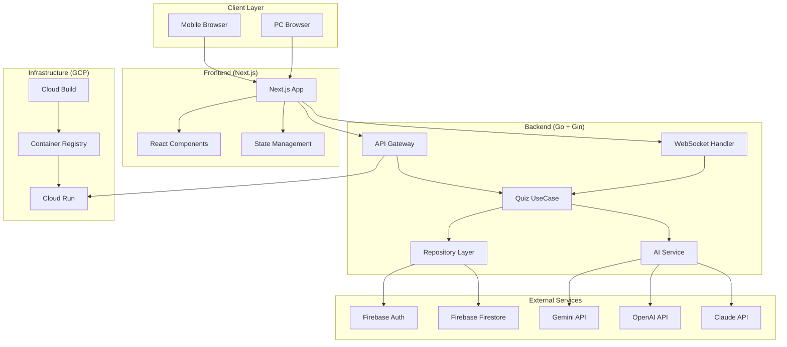
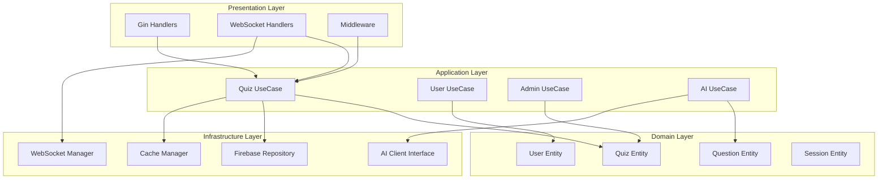

# 設計書

## 概要

グループ会社忘年会用サドンデス勝ち上がり式クイズアプリケーションの技術設計書。200人同時参加対応のリアルタイムクイズシステムを、Go（Gin）バックエンド、Next.js フロントエンド、Firebase、GCPを使用して構築する。

## アーキテクチャ

### システム全体構成



### Clean Architecture 構成



## コンポーネントと インターフェース

### フロントエンド（Next.js）

#### ディレクトリ構造
```
/frontend
├── src/
│   ├── components/
│   │   ├── atoms/          # Button, Input, Loading等
│   │   ├── molecules/      # QuestionCard, UserList等
│   │   ├── organisms/      # QuizBoard, AdminPanel等
│   │   └── templates/      # PageLayout等
│   ├── containers/         # Container-Presenter パターン
│   │   ├── QuizContainer.tsx
│   │   ├── AdminContainer.tsx
│   │   └── ResultContainer.tsx
│   ├── hooks/              # カスタムHook
│   │   ├── useQuiz.ts
│   │   ├── useWebSocket.ts
│   │   ├── useAuth.ts
│   │   └── useAI.ts
│   ├── store/              # Zustand状態管理
│   │   ├── quizStore.ts
│   │   ├── userStore.ts
│   │   └── adminStore.ts
│   ├── services/           # API通信
│   │   ├── quizService.ts
│   │   ├── adminService.ts
│   │   └── websocketService.ts
│   ├── types/              # TypeScript型定義
│   │   ├── quiz.ts
│   │   ├── user.ts
│   │   └── api.ts
│   └── pages/              # Next.js ページ
│       ├── index.tsx       # 参加者用クイズ画面
│       ├── admin.tsx       # 管理者用ダッシュボード
│       └── result.tsx      # 結果表示画面
```

#### 主要コンポーネント設計

**QuizContainer (Container-Presenter パターン)**
```typescript
// Container: ビジネスロジック
const QuizContainer: React.FC = () => {
  const { currentQuestion, participants, submitAnswer } = useQuiz();
  const { user } = useAuth();
  
  return (
    <QuizPresenter 
      question={currentQuestion}
      participants={participants}
      onSubmitAnswer={submitAnswer}
      user={user}
    />
  );
};

// Presenter: UI表示のみ
const QuizPresenter: React.FC<QuizPresenterProps> = ({
  question, participants, onSubmitAnswer, user
}) => {
  return (
    <QuizBoard>
      <QuestionCard question={question} onAnswer={onSubmitAnswer} />
      <ParticipantsList participants={participants} />
      <UserStatus user={user} />
    </QuizBoard>
  );
};
```

**カスタムHook設計**
```typescript
// useQuiz.ts - クイズ状態管理
export const useQuiz = () => {
  const { socket } = useWebSocket();
  const [currentQuestion, setCurrentQuestion] = useState<Question | null>(null);
  const [participants, setParticipants] = useState<User[]>([]);
  
  const submitAnswer = useCallback((answerId: string) => {
    socket?.emit('submit_answer', { answerId, userId: user.id });
  }, [socket, user]);
  
  return { currentQuestion, participants, submitAnswer };
};

// useWebSocket.ts - WebSocket通信管理
export const useWebSocket = () => {
  const [socket, setSocket] = useState<Socket | null>(null);
  
  useEffect(() => {
    const newSocket = io(process.env.NEXT_PUBLIC_WS_URL);
    setSocket(newSocket);
    
    return () => newSocket.close();
  }, []);
  
  return { socket };
};
```

### バックエンド（Go + Gin）

#### ディレクトリ構造
```
/backend
├── cmd/
│   └── server/
│       └── main.go
├── internal/
│   ├── handler/            # HTTP/WebSocketハンドラー
│   │   ├── quiz_handler.go
│   │   ├── admin_handler.go
│   │   └── websocket_handler.go
│   ├── usecase/            # ビジネスロジック
│   │   ├── quiz_usecase.go
│   │   ├── user_usecase.go
│   │   ├── admin_usecase.go
│   │   └── ai_usecase.go
│   ├── domain/             # ドメインエンティティ
│   │   ├── quiz.go
│   │   ├── user.go
│   │   ├── question.go
│   │   └── session.go
│   ├── repository/         # データアクセス層
│   │   ├── quiz_repository.go
│   │   ├── user_repository.go
│   │   └── firebase_repository.go
│   ├── service/            # 外部サービス連携
│   │   ├── ai_client.go
│   │   ├── gemini_client.go
│   │   ├── openai_client.go
│   │   └── claude_client.go
│   ├── middleware/         # ミドルウェア
│   │   ├── auth.go
│   │   ├── cors.go
│   │   └── logging.go
│   └── websocket/          # WebSocket管理
│       ├── hub.go
│       ├── client.go
│       └── message.go
├── pkg/
│   ├── config/
│   │   └── config.go
│   └── utils/
│       └── response.go
└── tests/
    ├── handler/
    ├── usecase/
    └── repository/
```

#### 主要インターフェース設計

**AI Client Strategy パターン**
```go
// AI API切り替え用インターフェース
type AIClient interface {
    GenerateQuestion(ctx context.Context, difficulty string, category string) (*Question, error)
    IsAvailable() bool
    GetName() string
}

// Gemini実装
type GeminiClient struct {
    apiKey string
    client *genai.Client
}

func (g *GeminiClient) GenerateQuestion(ctx context.Context, difficulty, category string) (*Question, error) {
    // Gemini API呼び出し実装
}

// AI Service - Strategy パターンで切り替え
type AIService struct {
    clients []AIClient
    current AIClient
}

func (s *AIService) GenerateQuestion(ctx context.Context, difficulty, category string) (*Question, error) {
    for _, client := range s.clients {
        if client.IsAvailable() {
            s.current = client
            return client.GenerateQuestion(ctx, difficulty, category)
        }
    }
    return nil, errors.New("no AI service available")
}
```

**Repository パターン**
```go
// Repository インターフェース
type QuizRepository interface {
    CreateSession(ctx context.Context, session *Session) error
    GetSession(ctx context.Context, sessionID string) (*Session, error)
    UpdateSession(ctx context.Context, session *Session) error
    SaveAnswer(ctx context.Context, answer *Answer) error
    GetParticipants(ctx context.Context, sessionID string) ([]*User, error)
}

// Firebase実装
type FirebaseQuizRepository struct {
    client *firestore.Client
}

func (r *FirebaseQuizRepository) CreateSession(ctx context.Context, session *Session) error {
    _, err := r.client.Collection("sessions").Doc(session.ID).Set(ctx, session)
    return err
}
```

**WebSocket Hub管理**
```go
type Hub struct {
    clients    map[*Client]bool
    broadcast  chan []byte
    register   chan *Client
    unregister chan *Client
    sessions   map[string]*QuizSession
}

type Client struct {
    hub     *Hub
    conn    *websocket.Conn
    send    chan []byte
    userID  string
    sessionID string
}

func (h *Hub) Run() {
    for {
        select {
        case client := <-h.register:
            h.clients[client] = true
            // 参加者をセッションに追加
            
        case client := <-h.unregister:
            if _, ok := h.clients[client]; ok {
                delete(h.clients, client)
                close(client.send)
            }
            
        case message := <-h.broadcast:
            // 全クライアントにメッセージ配信
            for client := range h.clients {
                select {
                case client.send <- message:
                default:
                    close(client.send)
                    delete(h.clients, client)
                }
            }
        }
    }
}
```

## データモデル

### Firestore コレクション設計

```typescript
// sessions コレクション
interface Session {
  id: string;
  title: string;
  status: 'waiting' | 'active' | 'finished';
  currentRound: number;
  maxParticipants: number;
  createdAt: Timestamp;
  updatedAt: Timestamp;
  settings: {
    timeLimit: number;
    revivalEnabled: boolean;
    revivalCount: number;
  };
}

// questions サブコレクション (sessions/{sessionId}/questions)
interface Question {
  id: string;
  round: number;
  text: string;
  options: string[];
  correctAnswer: number;
  difficulty: 'easy' | 'medium' | 'hard';
  category: string;
  aiProvider: 'gemini' | 'openai' | 'claude';
  createdAt: Timestamp;
}

// participants サブコレクション (sessions/{sessionId}/participants)
interface Participant {
  id: string;
  userId: string;
  displayName: string;
  status: 'active' | 'eliminated' | 'revived';
  joinedAt: Timestamp;
  eliminatedAt?: Timestamp;
  revivedAt?: Timestamp;
  score: number;
  correctAnswers: number;
}

// answers サブコレクション (sessions/{sessionId}/answers)
interface Answer {
  id: string;
  userId: string;
  questionId: string;
  selectedOption: number;
  isCorrect: boolean;
  answeredAt: Timestamp;
  responseTime: number; // ミリ秒
}

// users コレクション
interface User {
  id: string;
  displayName: string;
  email?: string;
  isAnonymous: boolean;
  createdAt: Timestamp;
  lastLoginAt: Timestamp;
}
```

### Go構造体定義

```go
// domain/session.go
type Session struct {
    ID              string    `json:"id" firestore:"id"`
    Title           string    `json:"title" firestore:"title"`
    Status          string    `json:"status" firestore:"status"`
    CurrentRound    int       `json:"currentRound" firestore:"currentRound"`
    MaxParticipants int       `json:"maxParticipants" firestore:"maxParticipants"`
    CreatedAt       time.Time `json:"createdAt" firestore:"createdAt"`
    UpdatedAt       time.Time `json:"updatedAt" firestore:"updatedAt"`
    Settings        Settings  `json:"settings" firestore:"settings"`
}

type Settings struct {
    TimeLimit      int  `json:"timeLimit" firestore:"timeLimit"`
    RevivalEnabled bool `json:"revivalEnabled" firestore:"revivalEnabled"`
    RevivalCount   int  `json:"revivalCount" firestore:"revivalCount"`
}

// domain/question.go
type Question struct {
    ID            string    `json:"id" firestore:"id"`
    Round         int       `json:"round" firestore:"round"`
    Text          string    `json:"text" firestore:"text"`
    Options       []string  `json:"options" firestore:"options"`
    CorrectAnswer int       `json:"correctAnswer" firestore:"correctAnswer"`
    Difficulty    string    `json:"difficulty" firestore:"difficulty"`
    Category      string    `json:"category" firestore:"category"`
    AIProvider    string    `json:"aiProvider" firestore:"aiProvider"`
    CreatedAt     time.Time `json:"createdAt" firestore:"createdAt"`
}
```

## エラーハンドリング

### フロントエンド エラー処理

```typescript
// エラー型定義
interface AppError {
  code: string;
  message: string;
  details?: any;
}

// エラーハンドリングHook
export const useErrorHandler = () => {
  const [error, setError] = useState<AppError | null>(null);
  
  const handleError = useCallback((error: any) => {
    if (error.response?.data) {
      setError({
        code: error.response.data.code,
        message: error.response.data.message,
        details: error.response.data.details
      });
    } else {
      setError({
        code: 'UNKNOWN_ERROR',
        message: 'An unexpected error occurred',
        details: error
      });
    }
  }, []);
  
  const clearError = useCallback(() => setError(null), []);
  
  return { error, handleError, clearError };
};

// WebSocketエラーハンドリング
export const useWebSocket = () => {
  const { handleError } = useErrorHandler();
  
  useEffect(() => {
    socket?.on('error', (error) => {
      handleError(error);
    });
    
    socket?.on('disconnect', () => {
      // 再接続処理
      setTimeout(() => {
        socket?.connect();
      }, 1000);
    });
  }, [socket, handleError]);
};
```

### バックエンド エラー処理

```go
// pkg/errors/errors.go
type AppError struct {
    Code    string `json:"code"`
    Message string `json:"message"`
    Details any    `json:"details,omitempty"`
}

func (e *AppError) Error() string {
    return e.Message
}

// 定義済みエラー
var (
    ErrSessionNotFound = &AppError{
        Code:    "SESSION_NOT_FOUND",
        Message: "Session not found",
    }
    
    ErrAIServiceUnavailable = &AppError{
        Code:    "AI_SERVICE_UNAVAILABLE", 
        Message: "AI service is currently unavailable",
    }
    
    ErrInvalidAnswer = &AppError{
        Code:    "INVALID_ANSWER",
        Message: "Invalid answer format",
    }
)

// middleware/error.go
func ErrorHandler() gin.HandlerFunc {
    return func(c *gin.Context) {
        c.Next()
        
        if len(c.Errors) > 0 {
            err := c.Errors.Last().Err
            
            if appErr, ok := err.(*AppError); ok {
                c.JSON(400, appErr)
                return
            }
            
            // 未知のエラー
            c.JSON(500, &AppError{
                Code:    "INTERNAL_ERROR",
                Message: "Internal server error",
            })
        }
    }
}
```

## テスト戦略

### フロントエンド テスト

```typescript
// __tests__/components/QuizBoard.test.tsx
import { render, screen, fireEvent } from '@testing-library/react';
import { QuizBoard } from '@/components/organisms/QuizBoard';

describe('QuizBoard', () => {
  const mockQuestion = {
    id: '1',
    text: 'What is 2+2?',
    options: ['3', '4', '5', '6'],
    correctAnswer: 1
  };
  
  it('should display question and options', () => {
    render(<QuizBoard question={mockQuestion} onAnswer={jest.fn()} />);
    
    expect(screen.getByText('What is 2+2?')).toBeInTheDocument();
    expect(screen.getByText('4')).toBeInTheDocument();
  });
  
  it('should call onAnswer when option is selected', () => {
    const mockOnAnswer = jest.fn();
    render(<QuizBoard question={mockQuestion} onAnswer={mockOnAnswer} />);
    
    fireEvent.click(screen.getByText('4'));
    expect(mockOnAnswer).toHaveBeenCalledWith(1);
  });
});

// __tests__/hooks/useQuiz.test.ts
import { renderHook, act } from '@testing-library/react';
import { useQuiz } from '@/hooks/useQuiz';

describe('useQuiz', () => {
  it('should submit answer correctly', async () => {
    const { result } = renderHook(() => useQuiz());
    
    await act(async () => {
      result.current.submitAnswer('1');
    });
    
    // WebSocket送信の検証
    expect(mockSocket.emit).toHaveBeenCalledWith('submit_answer', {
      answerId: '1',
      userId: expect.any(String)
    });
  });
});
```

### バックエンド テスト

```go
// tests/handler/quiz_handler_test.go
func TestQuizHandler_CreateSession(t *testing.T) {
    // テスト用のGinエンジン設定
    gin.SetMode(gin.TestMode)
    router := gin.New()
    
    // モックリポジトリ
    mockRepo := &MockQuizRepository{}
    usecase := usecase.NewQuizUseCase(mockRepo)
    handler := handler.NewQuizHandler(usecase)
    
    router.POST("/sessions", handler.CreateSession)
    
    // テストケース
    t.Run("should create session successfully", func(t *testing.T) {
        reqBody := `{"title":"Test Quiz","maxParticipants":100}`
        req := httptest.NewRequest("POST", "/sessions", strings.NewReader(reqBody))
        req.Header.Set("Content-Type", "application/json")
        
        w := httptest.NewRecorder()
        router.ServeHTTP(w, req)
        
        assert.Equal(t, http.StatusCreated, w.Code)
        
        var response map[string]interface{}
        err := json.Unmarshal(w.Body.Bytes(), &response)
        assert.NoError(t, err)
        assert.Equal(t, "Test Quiz", response["title"])
    })
}

// tests/usecase/ai_usecase_test.go
func TestAIUseCase_GenerateQuestion(t *testing.T) {
    // モックAIクライアント
    mockGemini := &MockGeminiClient{}
    mockOpenAI := &MockOpenAIClient{}
    
    aiService := service.NewAIService([]service.AIClient{mockGemini, mockOpenAI})
    usecase := usecase.NewAIUseCase(aiService)
    
    t.Run("should use Gemini when available", func(t *testing.T) {
        mockGemini.On("IsAvailable").Return(true)
        mockGemini.On("GenerateQuestion", mock.Anything, "medium", "general").Return(&domain.Question{
            Text: "Test question",
            Options: []string{"A", "B", "C", "D"},
            CorrectAnswer: 0,
        }, nil)
        
        question, err := usecase.GenerateQuestion(context.Background(), "medium", "general")
        
        assert.NoError(t, err)
        assert.Equal(t, "Test question", question.Text)
        mockGemini.AssertExpectations(t)
    })
    
    t.Run("should fallback to OpenAI when Gemini unavailable", func(t *testing.T) {
        mockGemini.On("IsAvailable").Return(false)
        mockOpenAI.On("IsAvailable").Return(true)
        mockOpenAI.On("GenerateQuestion", mock.Anything, "medium", "general").Return(&domain.Question{
            Text: "Fallback question",
        }, nil)
        
        question, err := usecase.GenerateQuestion(context.Background(), "medium", "general")
        
        assert.NoError(t, err)
        assert.Equal(t, "Fallback question", question.Text)
    })
}
```

### 統合テスト

```go
// tests/integration/quiz_flow_test.go
func TestQuizFlow_Integration(t *testing.T) {
    // Firebase Emulator使用
    os.Setenv("FIRESTORE_EMULATOR_HOST", "localhost:8080")
    
    // テスト用サーバー起動
    server := setupTestServer()
    defer server.Close()
    
    t.Run("complete quiz flow", func(t *testing.T) {
        // 1. セッション作成
        sessionResp := createTestSession(t, server.URL)
        sessionID := sessionResp["id"].(string)
        
        // 2. 参加者登録
        userID := joinSession(t, server.URL, sessionID)
        
        // 3. 問題生成・配信
        question := generateQuestion(t, server.URL, sessionID)
        
        // 4. 回答送信
        submitAnswer(t, server.URL, sessionID, userID, question.ID, 0)
        
        // 5. 結果確認
        result := getResult(t, server.URL, sessionID, userID)
        assert.True(t, result.IsCorrect)
    })
}
```

この設計書では、要件書で定義した機能を実現するための技術的な詳細を網羅しています。Clean Architectureパターン、Strategy パターン、Repository パターンなどの設計パターンを適用し、200人同時参加に対応できるスケーラブルな構成になっています。