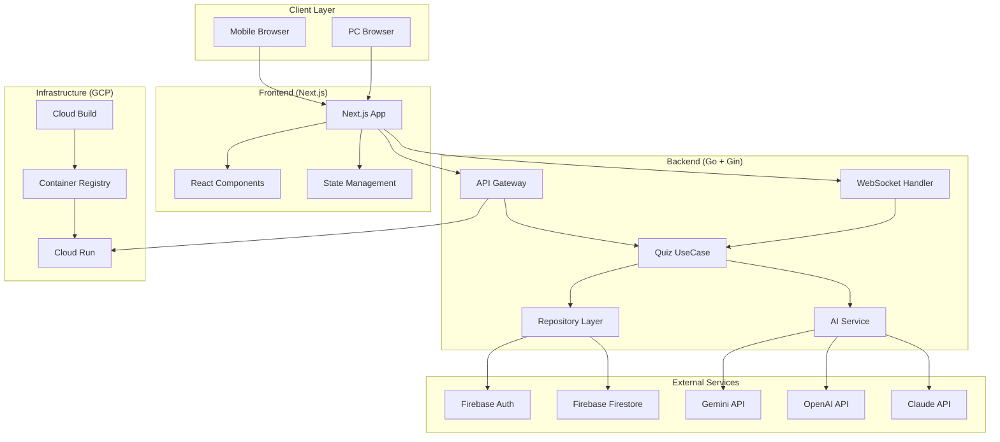
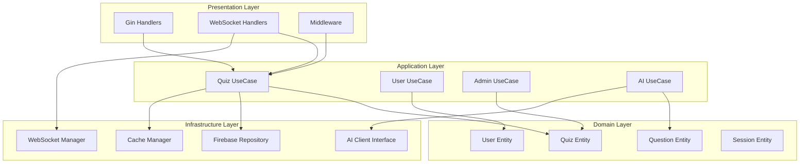

# 設計書

## 概要

グループ会社忘年会用サドンデス勝ち上がり式クイズアプリケーションの技術設計書。200人同時参加対応のリアルタイムクイズシステムを、Go（Gin）バックエンド、Next.js フロントエンド、Firebase、GCPを使用して構築する。

## アーキテクチャ

### システム全体構成



### Clean Architecture 構成



### ゲームフロー設計

#### 基本的なゲーム進行
1. **ゲーム作成フェーズ**
   - 管理者がログインし、管理画面からゲームを作成
   - システムが初期問題10問をAI APIで生成
   - ゲームが「参加可能」状態になる

2. **アクセス制御フェーズ**
   - 参加者がアプリにアクセスするとアクセスコード入力画面を表示
   - 有効な共通アクセスコード入力でログイン画面に遷移
   - 無効なコードの場合はエラー表示

3. **ユーザー認証フェーズ**
   - アクセスコード認証後、ログイン画面でユーザー名・パスワードを入力
   - 事前登録されたユーザー情報（admin/admin123, manager/manager123等）と照合
   - **ハイブリッド認証システム**:
     - バックエンド: セッションベース認証でサーバーサイド状態管理
     - フロントエンド: sessionStorageでクライアントサイド状態管理
     - GetMeエンドポイント問題の回避策として、ログイン成功時にユーザー情報をローカル保存
   - 認証成功時にユーザー情報をsessionStorage保存し、認証状態を維持
   - 認証成功で参加可能なゲーム一覧画面に遷移

4. **参加者参加フェーズ**
   - 参加者がログイン後、参加可能なゲーム一覧を表示
   - 参加者がゲームを選択して参加
   - リアルタイムで参加者数が更新される

3. **クイズ進行フェーズ**
   - 問題を1問ずつ配信（サドンデス形式）
   - 不正解者は即座に脱落
   - 10問連続正解者が出現した場合、追加で10問を自動生成

4. **敗者復活戦フェーズ**
   - 管理者が任意のタイミングで敗者復活戦を開始
   - 脱落者のみが参加可能（勝者は参加不可）
   - 復活者は現在進行中のゲームに再参加

5. **ゲーム終了フェーズ**
   - 最後の1人が残るか全員脱落でゲーム終了
   - 結果を記録し、統計情報を生成

#### 状態管理設計
```typescript
// 認証状態（ローカルストレージベース）
interface AuthState {
  isAccessCodeVerified: boolean;  // sessionStorage: 'accessCode'
  isLoggedIn: boolean;            // sessionStorage: 'user' の存在で判定
  user: User | null;              // sessionStorage: 'user' (JSON)
  accessCode: string | null;      // sessionStorage: 'accessCode'
}

// ユーザー情報（実装版）
interface User {
  id: string;
  username: string;
  displayName: string;
  email?: string;
  createdAt: Date;
  updatedAt: Date;
}

// 管理者権限情報
interface UserRole {
  admin: 'admin';
  manager: 'manager'; 
  user: 'user';
}

// 管理者ユーザー名マッピング
const AdminUsernames = {
  'admin': 'admin',
  'manager': 'manager'
};

// ゲーム状態
interface GameState {
  id: string;
  status: 'created' | 'waiting' | 'active' | 'revival' | 'finished';
  currentQuestionIndex: number;
  totalQuestions: number;
  participants: Participant[];
  eliminatedParticipants: Participant[];
  winners: Participant[];
}

// 参加者状態
interface Participant {
  id: string;
  userId: string;
  displayName: string;
  status: 'active' | 'eliminated' | 'winner' | 'revived';
  correctAnswers: number;
  joinedAt: Date;
  eliminatedAt?: Date;
  revivedAt?: Date;
}

// アクセスコード管理（複数コード対応）
interface AccessCodeConfig {
  filePath: string;
  validCodes: string[];  // 複数のアクセスコードをサポート
  lastUpdated: Date;
}

// ユーザー管理（実装版）
interface UserCredentials {
  username: string;
  password: string;
  displayName: string;
}

// 初期ユーザーデータ（シード用）
const InitialUsers = [
  { username: 'admin', password: 'admin123', displayName: 'システム管理者' },
  { username: 'manager', password: 'manager123', displayName: 'イベント管理者' },
  { username: 'user1', password: 'user123', displayName: '参加者1' },
  { username: 'testuser', password: 'password123', displayName: 'テストユーザー' },
  // 追加ユーザー...
];
```

## コンポーネントと インターフェース

### フロントエンド（Next.js）

#### ディレクトリ構造
```
/frontend
├── src/
│   ├── components/
│   │   ├── atoms/          # Button, Input, Loading等
│   │   ├── molecules/      # QuestionCard, UserList等
│   │   ├── organisms/      # QuizBoard, AdminPanel等
│   │   └── templates/      # PageLayout等
│   ├── containers/         # Container-Presenter パターン
│   │   ├── QuizContainer.tsx
│   │   ├── AdminContainer.tsx
│   │   └── ResultContainer.tsx
│   ├── hooks/              # カスタムHook
│   │   ├── useQuiz.ts
│   │   ├── useWebSocket.ts
│   │   ├── useAuth.ts
│   │   └── useAI.ts
│   ├── store/              # Zustand状態管理
│   │   ├── quizStore.ts
│   │   ├── userStore.ts
│   │   └── adminStore.ts
│   ├── services/           # API通信
│   │   ├── quizService.ts
│   │   ├── adminService.ts
│   │   └── websocketService.ts
│   ├── types/              # TypeScript型定義
│   │   ├── quiz.ts
│   │   ├── user.ts
│   │   └── api.ts
│   └── pages/              # Next.js ページ
│       ├── index.tsx       # 参加者用クイズ画面
│       ├── admin.tsx       # 管理者用ダッシュボード
│       └── result.tsx      # 結果表示画面
```

#### 主要コンポーネント設計

**AccessCodeContainer (Container-Presenter パターン)**
```typescript
// Container: アクセスコード認証ロジック
const AccessCodeContainer: React.FC = () => {
  const { verifyAccessCode, isVerifying, error } = useAccessCode();
  const [code, setCode] = useState('');
  
  const handleSubmit = async (inputCode: string) => {
    const isValid = await verifyAccessCode(inputCode);
    if (isValid) {
      // ログイン画面に遷移
      router.push('/login');
    }
  };
  
  return (
    <AccessCodePresenter 
      code={code}
      onCodeChange={setCode}
      onSubmit={handleSubmit}
      isVerifying={isVerifying}
      error={error}
    />
  );
};

// Presenter: UI表示のみ
const AccessCodePresenter: React.FC<AccessCodePresenterProps> = ({
  code, onCodeChange, onSubmit, isVerifying, error
}) => {
  return (
    <AccessCodeForm>
      <Input 
        value={code} 
        onChange={onCodeChange}
        placeholder="アクセスコードを入力"
        type="password"
      />
      <Button 
        onClick={() => onSubmit(code)}
        disabled={isVerifying || !code}
        isLoading={isVerifying}
      >
        確認
      </Button>
      {error && <ErrorMessage>{error}</ErrorMessage>}
    </AccessCodeForm>
  );
};
```

**LoginContainer (Container-Presenter パターン)**
```typescript
// Container: ユーザーログインロジック
const LoginContainer: React.FC = () => {
  const { login, isLoggingIn, error } = useAuth();
  const [credentials, setCredentials] = useState({
    username: '',
    password: ''
  });
  
  const handleSubmit = async (username: string, password: string) => {
    const success = await login(username, password);
    if (success) {
      // ゲーム一覧画面に遷移
      router.push('/games');
    }
  };
  
  return (
    <LoginPresenter 
      credentials={credentials}
      onCredentialsChange={setCredentials}
      onSubmit={handleSubmit}
      isLoggingIn={isLoggingIn}
      error={error}
    />
  );
};

// Presenter: UI表示のみ
const LoginPresenter: React.FC<LoginPresenterProps> = ({
  credentials, onCredentialsChange, onSubmit, isLoggingIn, error
}) => {
  return (
    <LoginForm>
      <Input 
        value={credentials.username} 
        onChange={(value) => onCredentialsChange({...credentials, username: value})}
        placeholder="ユーザー名"
        type="text"
      />
      <Input 
        value={credentials.password} 
        onChange={(value) => onCredentialsChange({...credentials, password: value})}
        placeholder="パスワード"
        type="password"
      />
      <Button 
        onClick={() => onSubmit(credentials.username, credentials.password)}
        disabled={isLoggingIn || !credentials.username || !credentials.password}
        isLoading={isLoggingIn}
      >
        ログイン
      </Button>
      {error && <ErrorMessage>{error}</ErrorMessage>}
    </LoginForm>
  );
};
```

**QuizContainer (Container-Presenter パターン)**
```typescript
// Container: ビジネスロジック
const QuizContainer: React.FC = () => {
  const { currentQuestion, participants, submitAnswer } = useQuiz();
  const { user } = useAuth();
  
  return (
    <QuizPresenter 
      question={currentQuestion}
      participants={participants}
      onSubmitAnswer={submitAnswer}
      user={user}
    />
  );
};

// Presenter: UI表示のみ
const QuizPresenter: React.FC<QuizPresenterProps> = ({
  question, participants, onSubmitAnswer, user
}) => {
  return (
    <QuizBoard>
      <QuestionCard question={question} onAnswer={onSubmitAnswer} />
      <ParticipantsList participants={participants} />
      <UserStatus user={user} />
    </QuizBoard>
  );
};
```

**認証サービス設計**
```typescript
// authService.ts - 統合認証管理サービス
class AuthService {
  private baseURL: string = `${API_BASE_URL}/api/v1/auth`;

  // アクセスコード検証
  async verifyAccessCode(accessCode: string): Promise<VerifyAccessCodeResponse> {
    const response = await fetch(`${this.baseURL}/verify-access-code`, {
      method: 'POST',
      headers: { 'Content-Type': 'application/json' },
      body: JSON.stringify({ accessCode }),
      credentials: 'include',
    });
    return response.json();
  }

  // ユーザーログイン（ローカルストレージ管理）
  async login(username: string, password: string): Promise<LoginResponse> {
    const response = await fetch(`${this.baseURL}/login`, {
      method: 'POST',
      headers: { 'Content-Type': 'application/json' },
      body: JSON.stringify({ username, password }),
      credentials: 'include',
    });
    
    const result = await response.json();
    
    // ログイン成功時にユーザー情報をローカルストレージに保存
    if (result.user) {
      this.saveUserToStorage(result.user);
    }
    return result;
  }

  // ローカル認証状態管理
  saveUserToStorage(user: any): void {
    sessionStorage.setItem('user', JSON.stringify(user));
  }

  getUserFromStorage(): any | null {
    const userStr = sessionStorage.getItem('user');
    return userStr ? JSON.parse(userStr) : null;
  }

  isAuthenticated(): boolean {
    return this.getAccessCodeFromStorage() !== null && 
           this.getUserFromStorage() !== null;
  }

  // 現在のユーザー情報取得（ローカルストレージから）
  async getMe(): Promise<GetMeResponse> {
    const user = this.getUserFromStorage();
    if (user) {
      return { user };
    }
    throw new Error('ユーザー情報が見つかりません。再ログインが必要です。');
  }
}
```

**カスタムHook設計**
```typescript
// useAccessCode.ts - アクセスコード認証管理
export const useAccessCode = () => {
  const [isVerifying, setIsVerifying] = useState(false);
  const [error, setError] = useState<string | null>(null);
  
  const verifyAccessCode = useCallback(async (code: string): Promise<boolean> => {
    setIsVerifying(true);
    setError(null);
    
    try {
      const response = await fetch('/api/auth/verify-access-code', {
        method: 'POST',
        headers: { 'Content-Type': 'application/json' },
        body: JSON.stringify({ accessCode: code })
      });
      
      if (response.ok) {
        // アクセスコードをセッションに保存
        sessionStorage.setItem('accessCode', code);
        return true;
      } else {
        setError('無効なアクセスコードです');
        return false;
      }
    } catch (err) {
      setError('認証エラーが発生しました');
      return false;
    } finally {
      setIsVerifying(false);
    }
  }, []);
  
  return { verifyAccessCode, isVerifying, error };
};

// useQuiz.ts - クイズ状態管理
export const useQuiz = () => {
  const { socket } = useWebSocket();
  const [currentQuestion, setCurrentQuestion] = useState<Question | null>(null);
  const [participants, setParticipants] = useState<User[]>([]);
  
  const submitAnswer = useCallback((answerId: string) => {
    socket?.emit('submit_answer', { answerId, userId: user.id });
  }, [socket, user]);
  
  return { currentQuestion, participants, submitAnswer };
};

// useWebSocket.ts - WebSocket通信管理
export const useWebSocket = () => {
  const [socket, setSocket] = useState<Socket | null>(null);
  
  useEffect(() => {
    const newSocket = io(process.env.NEXT_PUBLIC_WS_URL);
    setSocket(newSocket);
    
    return () => newSocket.close();
  }, []);
  
  return { socket };
};
```

### バックエンド（Go + Gin）

#### ディレクトリ構造
```
/backend
├── cmd/
│   └── server/
│       └── main.go
├── internal/
│   ├── handler/            # HTTP/WebSocketハンドラー
│   │   ├── quiz_handler.go
│   │   ├── admin_handler.go
│   │   ├── auth_handler.go
│   │   └── websocket_handler.go
│   ├── usecase/            # ビジネスロジック
│   │   ├── quiz_usecase.go
│   │   ├── user_usecase.go
│   │   ├── admin_usecase.go
│   │   ├── auth_usecase.go
│   │   └── ai_usecase.go
│   ├── domain/             # ドメインエンティティ
│   │   ├── quiz.go
│   │   ├── user.go
│   │   ├── question.go
│   │   ├── session.go
│   │   └── access_code.go
│   ├── repository/         # データアクセス層
│   │   ├── quiz_repository.go
│   │   ├── user_repository.go
│   │   ├── access_code_repository.go
│   │   └── firebase_repository.go
│   ├── service/            # 外部サービス連携
│   │   ├── ai_client.go
│   │   ├── gemini_client.go
│   │   ├── openai_client.go
│   │   ├── claude_client.go
│   │   └── access_code_service.go
│   ├── middleware/         # ミドルウェア
│   │   ├── auth.go
│   │   ├── access_code.go
│   │   ├── cors.go
│   │   └── logging.go
│   └── websocket/          # WebSocket管理
│       ├── hub.go
│       ├── client.go
│       └── message.go
├── pkg/
│   ├── config/
│   │   └── config.go
│   └── utils/
│       └── response.go
├── configs/
│   └── access_codes.txt    # アクセスコード管理ファイル
└── tests/
    ├── handler/
    ├── usecase/
    └── repository/
```

#### 主要インターフェース設計

**AI Client Strategy パターン**
```go
// AI API切り替え用インターフェース
type AIClient interface {
    GenerateQuestion(ctx context.Context, difficulty string, category string) (*Question, error)
    IsAvailable() bool
    GetName() string
}

// Gemini実装
type GeminiClient struct {
    apiKey string
    client *genai.Client
}

func (g *GeminiClient) GenerateQuestion(ctx context.Context, difficulty, category string) (*Question, error) {
    // Gemini API呼び出し実装
}

// AI Service - Strategy パターンで切り替え
type AIService struct {
    clients []AIClient
    current AIClient
}

func (s *AIService) GenerateQuestion(ctx context.Context, difficulty, category string) (*Question, error) {
    for _, client := range s.clients {
        if client.IsAvailable() {
            s.current = client
            return client.GenerateQuestion(ctx, difficulty, category)
        }
    }
    return nil, errors.New("no AI service available")
}
```

**Repository パターン**
```go
// Repository インターフェース
type QuizRepository interface {
    CreateSession(ctx context.Context, session *Session) error
    GetSession(ctx context.Context, sessionID string) (*Session, error)
    UpdateSession(ctx context.Context, session *Session) error
    SaveAnswer(ctx context.Context, answer *Answer) error
    GetParticipants(ctx context.Context, sessionID string) ([]*User, error)
}

// アクセスコード管理Repository（複数コード対応）
type AccessCodeRepository interface {
    LoadAccessCodes() ([]string, error)
    IsValidAccessCode(code string) bool
    GetValidAccessCodes() []string
    ReloadAccessCodes() error
}

// ユーザー管理Repository
type UserRepository interface {
    CreateUser(ctx context.Context, user *User, password string) error
    GetUserByUsername(ctx context.Context, username string) (*User, error)
    ValidateUserCredentials(ctx context.Context, username, password string) (*User, error)
    UpdateUser(ctx context.Context, user *User) error
    DeleteUser(ctx context.Context, userID string) error
    BulkCreateUsers(ctx context.Context, users []UserCredentials) error
}

// テキストファイル実装（複数アクセスコード対応）
type FileAccessCodeRepository struct {
    filePath string
    codes    []string
    lastMod  time.Time
}

func (r *FileAccessCodeRepository) LoadAccessCodes() ([]string, error) {
    file, err := os.Open(r.filePath)
    if err != nil {
        return nil, err
    }
    defer file.Close()
    
    var codes []string
    scanner := bufio.NewScanner(file)
    for scanner.Scan() {
        line := strings.TrimSpace(scanner.Text())
        if line != "" && !strings.HasPrefix(line, "#") {
            codes = append(codes, line)
        }
    }
    
    if len(codes) == 0 {
        return nil, errors.New("no valid access codes found")
    }
    
    r.codes = codes
    return codes, nil
}

func (r *FileAccessCodeRepository) IsValidAccessCode(code string) bool {
    // ファイル更新チェック
    if r.shouldReload() {
        r.ReloadAccessCodes()
    }
    
    for _, validCode := range r.codes {
        if validCode == code {
            return true
        }
    }
    return false
}

func (r *FileAccessCodeRepository) GetValidAccessCodes() []string {
    return r.codes
}

// Firebase実装（ユーザー管理）
type FirebaseUserRepository struct {
    client *firestore.Client
}

func (r *FirebaseUserRepository) ValidateUserCredentials(ctx context.Context, username, password string) (*User, error) {
    // ユーザー取得
    doc, err := r.client.Collection("users").Doc(username).Get(ctx)
    if err != nil {
        return nil, err
    }
    
    var userData struct {
        User
        PasswordHash string `firestore:"passwordHash"`
    }
    
    if err := doc.DataTo(&userData); err != nil {
        return nil, err
    }
    
    // パスワード検証
    if !r.verifyPassword(password, userData.PasswordHash) {
        return nil, errors.New("invalid credentials")
    }
    
    return &userData.User, nil
}

func (r *FirebaseUserRepository) verifyPassword(password, hash string) bool {
    // bcryptを使用したパスワード検証
    err := bcrypt.CompareHashAndPassword([]byte(hash), []byte(password))
    return err == nil
}

// Firebase実装
type FirebaseQuizRepository struct {
    client *firestore.Client
}

func (r *FirebaseQuizRepository) CreateSession(ctx context.Context, session *Session) error {
    _, err := r.client.Collection("sessions").Doc(session.ID).Set(ctx, session)
    return err
}
```

**WebSocket Hub管理**
```go
type Hub struct {
    clients    map[*Client]bool
    broadcast  chan []byte
    register   chan *Client
    unregister chan *Client
    sessions   map[string]*QuizSession
}

type Client struct {
    hub     *Hub
    conn    *websocket.Conn
    send    chan []byte
    userID  string
    sessionID string
}

func (h *Hub) Run() {
    for {
        select {
        case client := <-h.register:
            h.clients[client] = true
            // 参加者をセッションに追加
            
        case client := <-h.unregister:
            if _, ok := h.clients[client]; ok {
                delete(h.clients, client)
                close(client.send)
            }
            
        case message := <-h.broadcast:
            // 全クライアントにメッセージ配信
            for client := range h.clients {
                select {
                case client.send <- message:
                default:
                    close(client.send)
                    delete(h.clients, client)
                }
            }
        }
    }
}

// 認証ハンドラー設計
type AuthHandler struct {
    authUseCase AuthUseCase
}

func (h *AuthHandler) VerifyAccessCode(c *gin.Context) {
    var req struct {
        AccessCode string `json:"accessCode" binding:"required"`
    }
    
    if err := c.ShouldBindJSON(&req); err != nil {
        c.JSON(400, gin.H{"error": "Invalid request"})
        return
    }
    
    isValid, err := h.authUseCase.VerifyAccessCode(c.Request.Context(), req.AccessCode)
    if err != nil {
        c.JSON(500, gin.H{"error": "Internal server error"})
        return
    }
    
    if !isValid {
        c.JSON(401, gin.H{"error": "Invalid access code"})
        return
    }
    
    // セッションにアクセスコードを保存
    session := sessions.Default(c)
    session.Set("access_code_verified", true)
    session.Set("access_code", req.AccessCode)
    session.Save()
    
    c.JSON(200, gin.H{"message": "Access code verified"})
}

func (h *AuthHandler) Login(c *gin.Context) {
    // セッションからアクセスコード認証済みかチェック
    session := sessions.Default(c)
    accessCodeVerified := session.Get("access_code_verified")
    if accessCodeVerified != true {
        c.JSON(401, gin.H{"error": "アクセスコード認証が必要です"})
        return
    }

    // カスタムJSONパース（バリデーションエラー回避）
    body, err := c.GetRawData()
    if err != nil {
        c.JSON(400, gin.H{"error": "Failed to read request body"})
        return
    }

    var requestData map[string]interface{}
    if err := json.Unmarshal(body, &requestData); err != nil {
        c.JSON(400, gin.H{"error": "Invalid JSON format"})
        return
    }

    username, usernameExists := requestData["username"].(string)
    password, passwordExists := requestData["password"].(string)

    if !usernameExists || !passwordExists || username == "" || password == "" {
        c.JSON(400, gin.H{"error": "username and password are required"})
        return
    }
    
    // ユーザー認証
    user, err := h.authUseCase.AuthenticateUser(c.Request.Context(), username, password)
    if err != nil {
        h.logLoginAttempt(c, username, false)
        c.JSON(401, gin.H{"error": "無効なユーザー名またはパスワードです"})
        return
    }
    
    // ログイン成功ログ
    h.logLoginAttempt(c, username, true)
    
    // セッションにユーザー情報を保存
    session.Set("user_id", user.ID)
    session.Set("username", user.Username)
    session.Set("display_name", user.DisplayName)
    session.Save()
    
    c.JSON(200, gin.H{
        "user":    user,
        "message": "ログインが成功しました",
    })
}

// 現在のユーザー情報取得（フロントエンドではローカルストレージから取得）
func (h *AuthHandler) GetMe(c *gin.Context) {
    // 注意: 現在の実装では/meエンドポイントはフロントエンドで
    // ローカルストレージから直接取得するため、このエンドポイントは
    // 実際には使用されない。バックエンドの認証状態はセッションで管理。
}

// 管理者用ユーザー管理API（管理者権限チェック付き）
func (h *AuthHandler) CreateUser(c *gin.Context) {
    var req struct {
        Username    string `json:"username" binding:"required"`
        Password    string `json:"password" binding:"required"`
        DisplayName string `json:"displayName" binding:"required"`
    }
    
    if err := c.ShouldBindJSON(&req); err != nil {
        c.JSON(400, gin.H{"error": "Invalid request format"})
        return
    }
    
    user, err := h.authUseCase.CreateUser(c.Request.Context(), req.Username, req.Password, req.DisplayName)
    if err != nil {
        if strings.Contains(err.Error(), "already exists") {
            c.JSON(409, gin.H{"error": "ユーザー名が既に存在します"})
        } else {
            c.JSON(500, gin.H{"error": "ユーザー作成に失敗しました"})
        }
        return
    }
    
    c.JSON(201, gin.H{
        "user":    user,
        "message": "ユーザーが作成されました",
    })
}

func (h *AuthHandler) GetUsers(c *gin.Context) {
    users, err := h.authUseCase.GetAllUsers(c.Request.Context())
    if err != nil {
        c.JSON(500, gin.H{"error": "ユーザー一覧の取得に失敗しました"})
        return
    }

    c.JSON(200, gin.H{
        "users": users,
        "count": len(users),
    })
}

func (h *AuthHandler) DeleteUser(c *gin.Context) {
    userID := c.Param("id")
    if userID == "" {
        c.JSON(400, gin.H{"error": "ユーザーIDが必要です"})
        return
    }

    err := h.authUseCase.DeleteUser(c.Request.Context(), userID)
    if err != nil {
        if strings.Contains(err.Error(), "not found") {
            c.JSON(404, gin.H{"error": "ユーザーが見つかりません"})
        } else {
            c.JSON(500, gin.H{"error": "ユーザーの削除に失敗しました"})
        }
        return
    }

    c.JSON(200, gin.H{"message": "ユーザーが削除されました"})
}

func (h *AuthHandler) BulkCreateUsers(c *gin.Context) {
    var req struct {
        Users []UserCredentials `json:"users" binding:"required"`
    }
    
    if err := c.ShouldBindJSON(&req); err != nil {
        c.JSON(400, gin.H{"error": "Invalid request format"})
        return
    }
    
    err := h.authUseCase.BulkCreateUsers(c.Request.Context(), req.Users)
    if err != nil {
        c.JSON(500, gin.H{"error": "一括ユーザー作成に失敗しました"})
        return
    }
    
    c.JSON(201, gin.H{
        "message": fmt.Sprintf("%d人のユーザーが作成されました", len(req.Users)),
        "count":   len(req.Users),
    })
}
```

## データモデル

### Firestore コレクション設計

```typescript
// sessions コレクション
interface Session {
  id: string;
  title: string;
  status: 'waiting' | 'active' | 'finished';
  currentRound: number;
  maxParticipants: number;
  createdAt: Timestamp;
  updatedAt: Timestamp;
  settings: {
    timeLimit: number;
    revivalEnabled: boolean;
    revivalCount: number;
  };
}

// questions サブコレクション (sessions/{sessionId}/questions)
interface Question {
  id: string;
  round: number;
  text: string;
  options: string[];
  correctAnswer: number;
  difficulty: 'easy' | 'medium' | 'hard';
  category: string;
  aiProvider: 'gemini' | 'openai' | 'claude';
  createdAt: Timestamp;
}

// participants サブコレクション (sessions/{sessionId}/participants)
interface Participant {
  id: string;
  userId: string;
  displayName: string;
  status: 'active' | 'eliminated' | 'revived';
  joinedAt: Timestamp;
  eliminatedAt?: Timestamp;
  revivedAt?: Timestamp;
  score: number;
  correctAnswers: number;
}

// answers サブコレクション (sessions/{sessionId}/answers)
interface Answer {
  id: string;
  userId: string;
  questionId: string;
  selectedOption: number;
  isCorrect: boolean;
  answeredAt: Timestamp;
  responseTime: number; // ミリ秒
}

// users コレクション
interface User {
  id: string;
  displayName: string;
  email?: string;
  isAnonymous: boolean;
  createdAt: Timestamp;
  lastLoginAt: Timestamp;
}
```

### Go構造体定義

```go
// domain/session.go
type Session struct {
    ID              string    `json:"id" firestore:"id"`
    Title           string    `json:"title" firestore:"title"`
    Status          string    `json:"status" firestore:"status"`
    CurrentRound    int       `json:"currentRound" firestore:"currentRound"`
    MaxParticipants int       `json:"maxParticipants" firestore:"maxParticipants"`
    CreatedAt       time.Time `json:"createdAt" firestore:"createdAt"`
    UpdatedAt       time.Time `json:"updatedAt" firestore:"updatedAt"`
    Settings        Settings  `json:"settings" firestore:"settings"`
}

type Settings struct {
    TimeLimit      int  `json:"timeLimit" firestore:"timeLimit"`
    RevivalEnabled bool `json:"revivalEnabled" firestore:"revivalEnabled"`
    RevivalCount   int  `json:"revivalCount" firestore:"revivalCount"`
}

// domain/question.go
type Question struct {
    ID            string    `json:"id" firestore:"id"`
    Round         int       `json:"round" firestore:"round"`
    Text          string    `json:"text" firestore:"text"`
    Options       []string  `json:"options" firestore:"options"`
    CorrectAnswer int       `json:"correctAnswer" firestore:"correctAnswer"`
    Difficulty    string    `json:"difficulty" firestore:"difficulty"`
    Category      string    `json:"category" firestore:"category"`
    AIProvider    string    `json:"aiProvider" firestore:"aiProvider"`
    CreatedAt     time.Time `json:"createdAt" firestore:"createdAt"`
}
```

## エラーハンドリング

### フロントエンド エラー処理

```typescript
// エラー型定義
interface AppError {
  code: string;
  message: string;
  details?: any;
}

// エラーハンドリングHook
export const useErrorHandler = () => {
  const [error, setError] = useState<AppError | null>(null);
  
  const handleError = useCallback((error: any) => {
    if (error.response?.data) {
      setError({
        code: error.response.data.code,
        message: error.response.data.message,
        details: error.response.data.details
      });
    } else {
      setError({
        code: 'UNKNOWN_ERROR',
        message: 'An unexpected error occurred',
        details: error
      });
    }
  }, []);
  
  const clearError = useCallback(() => setError(null), []);
  
  return { error, handleError, clearError };
};

// WebSocketエラーハンドリング
export const useWebSocket = () => {
  const { handleError } = useErrorHandler();
  
  useEffect(() => {
    socket?.on('error', (error) => {
      handleError(error);
    });
    
    socket?.on('disconnect', () => {
      // 再接続処理
      setTimeout(() => {
        socket?.connect();
      }, 1000);
    });
  }, [socket, handleError]);
};
```

### バックエンド エラー処理

```go
// pkg/errors/errors.go
type AppError struct {
    Code    string `json:"code"`
    Message string `json:"message"`
    Details any    `json:"details,omitempty"`
}

func (e *AppError) Error() string {
    return e.Message
}

// 定義済みエラー
var (
    ErrSessionNotFound = &AppError{
        Code:    "SESSION_NOT_FOUND",
        Message: "Session not found",
    }
    
    ErrAIServiceUnavailable = &AppError{
        Code:    "AI_SERVICE_UNAVAILABLE", 
        Message: "AI service is currently unavailable",
    }
    
    ErrInvalidAnswer = &AppError{
        Code:    "INVALID_ANSWER",
        Message: "Invalid answer format",
    }
)

// middleware/error.go
func ErrorHandler() gin.HandlerFunc {
    return func(c *gin.Context) {
        c.Next()
        
        if len(c.Errors) > 0 {
            err := c.Errors.Last().Err
            
            if appErr, ok := err.(*AppError); ok {
                c.JSON(400, appErr)
                return
            }
            
            // 未知のエラー
            c.JSON(500, &AppError{
                Code:    "INTERNAL_ERROR",
                Message: "Internal server error",
            })
        }
    }
}
```

## テスト戦略

### フロントエンド テスト

```typescript
// __tests__/components/QuizBoard.test.tsx
import { render, screen, fireEvent } from '@testing-library/react';
import { QuizBoard } from '@/components/organisms/QuizBoard';

describe('QuizBoard', () => {
  const mockQuestion = {
    id: '1',
    text: 'What is 2+2?',
    options: ['3', '4', '5', '6'],
    correctAnswer: 1
  };
  
  it('should display question and options', () => {
    render(<QuizBoard question={mockQuestion} onAnswer={jest.fn()} />);
    
    expect(screen.getByText('What is 2+2?')).toBeInTheDocument();
    expect(screen.getByText('4')).toBeInTheDocument();
  });
  
  it('should call onAnswer when option is selected', () => {
    const mockOnAnswer = jest.fn();
    render(<QuizBoard question={mockQuestion} onAnswer={mockOnAnswer} />);
    
    fireEvent.click(screen.getByText('4'));
    expect(mockOnAnswer).toHaveBeenCalledWith(1);
  });
});

// __tests__/hooks/useQuiz.test.ts
import { renderHook, act } from '@testing-library/react';
import { useQuiz } from '@/hooks/useQuiz';

describe('useQuiz', () => {
  it('should submit answer correctly', async () => {
    const { result } = renderHook(() => useQuiz());
    
    await act(async () => {
      result.current.submitAnswer('1');
    });
    
    // WebSocket送信の検証
    expect(mockSocket.emit).toHaveBeenCalledWith('submit_answer', {
      answerId: '1',
      userId: expect.any(String)
    });
  });
});
```

### バックエンド テスト

```go
// tests/handler/quiz_handler_test.go
func TestQuizHandler_CreateSession(t *testing.T) {
    // テスト用のGinエンジン設定
    gin.SetMode(gin.TestMode)
    router := gin.New()
    
    // モックリポジトリ
    mockRepo := &MockQuizRepository{}
    usecase := usecase.NewQuizUseCase(mockRepo)
    handler := handler.NewQuizHandler(usecase)
    
    router.POST("/sessions", handler.CreateSession)
    
    // テストケース
    t.Run("should create session successfully", func(t *testing.T) {
        reqBody := `{"title":"Test Quiz","maxParticipants":100}`
        req := httptest.NewRequest("POST", "/sessions", strings.NewReader(reqBody))
        req.Header.Set("Content-Type", "application/json")
        
        w := httptest.NewRecorder()
        router.ServeHTTP(w, req)
        
        assert.Equal(t, http.StatusCreated, w.Code)
        
        var response map[string]interface{}
        err := json.Unmarshal(w.Body.Bytes(), &response)
        assert.NoError(t, err)
        assert.Equal(t, "Test Quiz", response["title"])
    })
}

// tests/usecase/ai_usecase_test.go
func TestAIUseCase_GenerateQuestion(t *testing.T) {
    // モックAIクライアント
    mockGemini := &MockGeminiClient{}
    mockOpenAI := &MockOpenAIClient{}
    
    aiService := service.NewAIService([]service.AIClient{mockGemini, mockOpenAI})
    usecase := usecase.NewAIUseCase(aiService)
    
    t.Run("should use Gemini when available", func(t *testing.T) {
        mockGemini.On("IsAvailable").Return(true)
        mockGemini.On("GenerateQuestion", mock.Anything, "medium", "general").Return(&domain.Question{
            Text: "Test question",
            Options: []string{"A", "B", "C", "D"},
            CorrectAnswer: 0,
        }, nil)
        
        question, err := usecase.GenerateQuestion(context.Background(), "medium", "general")
        
        assert.NoError(t, err)
        assert.Equal(t, "Test question", question.Text)
        mockGemini.AssertExpectations(t)
    })
    
    t.Run("should fallback to OpenAI when Gemini unavailable", func(t *testing.T) {
        mockGemini.On("IsAvailable").Return(false)
        mockOpenAI.On("IsAvailable").Return(true)
        mockOpenAI.On("GenerateQuestion", mock.Anything, "medium", "general").Return(&domain.Question{
            Text: "Fallback question",
        }, nil)
        
        question, err := usecase.GenerateQuestion(context.Background(), "medium", "general")
        
        assert.NoError(t, err)
        assert.Equal(t, "Fallback question", question.Text)
    })
}
```

### 統合テスト

```go
// tests/integration/quiz_flow_test.go
func TestQuizFlow_Integration(t *testing.T) {
    // Firebase Emulator使用
    os.Setenv("FIRESTORE_EMULATOR_HOST", "localhost:8080")
    
    // テスト用サーバー起動
    server := setupTestServer()
    defer server.Close()
    
    t.Run("complete quiz flow", func(t *testing.T) {
        // 1. セッション作成
        sessionResp := createTestSession(t, server.URL)
        sessionID := sessionResp["id"].(string)
        
        // 2. 参加者登録
        userID := joinSession(t, server.URL, sessionID)
        
        // 3. 問題生成・配信
        question := generateQuestion(t, server.URL, sessionID)
        
        // 4. 回答送信
        submitAnswer(t, server.URL, sessionID, userID, question.ID, 0)
        
        // 5. 結果確認
        result := getResult(t, server.URL, sessionID, userID)
        assert.True(t, result.IsCorrect)
    })
}
```

この設計書では、要件書で定義した機能を実現するための技術的な詳細を網羅しています。Clean Architectureパターン、Strategy パターン、Repository パターンなどの設計パターンを適用し、200人同時参加に対応できるスケーラブルな構成になっています。